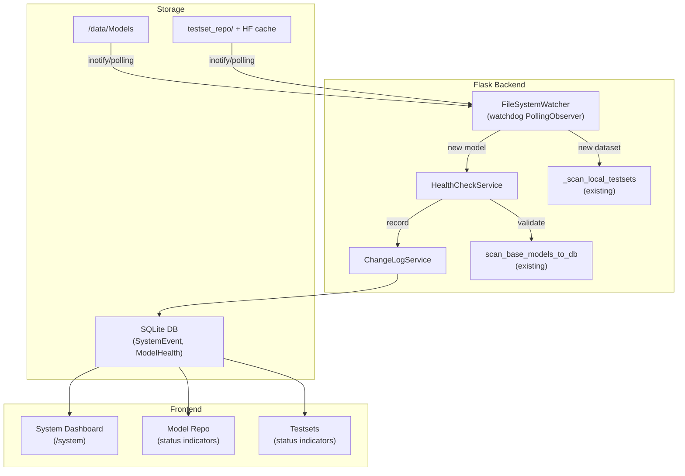
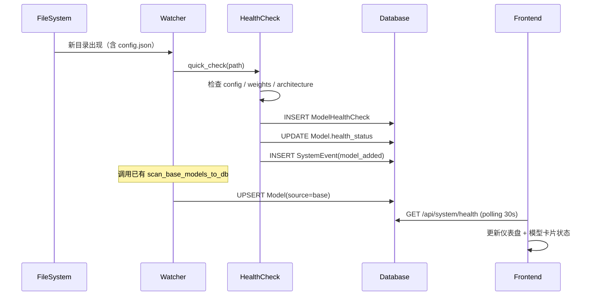
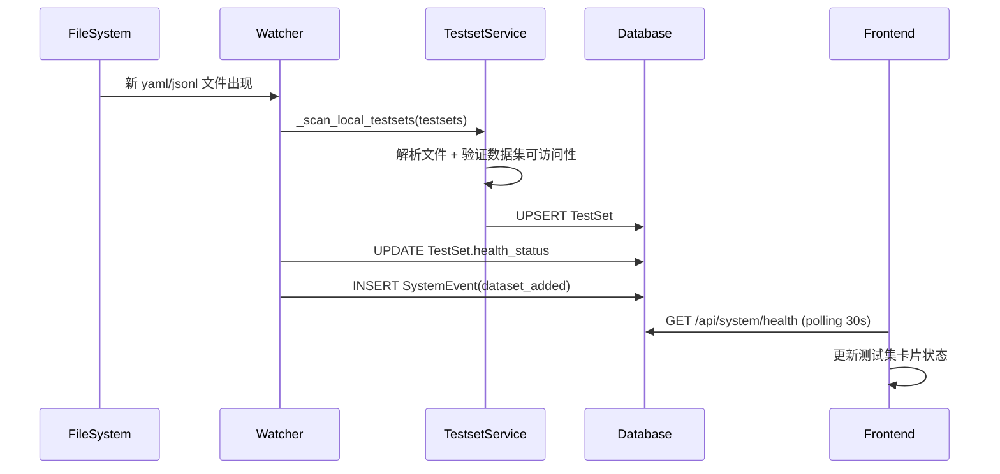

# 系统健康监控、仓库自动发现与变更日志

## 整体架构



## 一、新增 DB 模型

在 [app/models.py](Workspaces/mergeKit_beta/app/models.py) 中新增两张表，并为现有表补字段：

### 1.1 `SystemEvent` 表（变更日志）

记录所有环境层和业务层变更：

- `id`: 主键 UUID
- `event_type`: 枚举字符串 — `model_added`, `model_removed`, `model_health_changed`, `dataset_added`, `dataset_removed`, `dependency_upgraded`, `git_commit`, `docker_rebuild`, `task_config_changed`, `manual_check`
- `target`: 受影响对象名称（模型名、包名、commit hash 等）
- `severity`: `info` / `warning` / `error`
- `details`: JSON 字段，存具体变更内容
- `created_at`: 时间戳

### 1.2 `ModelHealthCheck` 表（健康检查结果）

- `id`: 主键 UUID
- `model_id`: 外键关联 `Model`
- `check_type`: `quick` / `deep`
- `healthy`: bool
- `config_valid`: bool
- `weights_complete`: bool
- `architecture`: 检测到的架构字符串
- `weight_format`: `safetensors` / `bin` / `mixed` / `missing`
- `total_tensors`: int
- `bad_tensors`: int
- `size_bytes`: int
- `details`: JSON（完整诊断信息）
- `created_at`: 时间戳

### 1.3 现有表补字段

- `Model` 表新增 `health_status` 字段：`unknown` / `checking` / `healthy` / `warning` / `error`
- `TestSet` 表新增 `health_status` 字段：同上

## 二、后端服务

### 2.1 `app/watcher.py` — 文件系统监听器

**依赖**：`watchdog`（加入 `environment.yml`）

**核心逻辑**：

- 使用 `watchdog.observers.polling.PollingObserver`（兼容 Docker bind mount，inotify 在某些挂载方式下不可靠）
- 监听目录：
  - `LOCAL_MODELS_PATH`（模型目录）
  - `model_pool_path`（模型池）
  - `testset_repo/yaml/`（测试集 yaml）
  - `testset_repo/data/`（测试集数据）
  - HF 数据集缓存目录（`HF_DATASETS_CACHE`）
- 轮询间隔：**30 秒**（可通过环境变量 `WATCHER_INTERVAL` 配置）
- 事件处理：
  - **模型目录新增子目录**（含 `config.json`）→ 触发 `HealthCheckService.quick_check(path)` → 结果写入 `ModelHealthCheck` + `SystemEvent`
  - **模型目录删除** → 标记对应 `Model.health_status = 'error'` + 记录 `SystemEvent(model_removed)`
  - **测试集目录新增文件** → 触发已有 `_scan_local_testsets` + 验证 → 记录 `SystemEvent(dataset_added)`
  - **HF 缓存目录变化** → 检测新下载的数据集 → 验证可用性
- 启动方式：在 `create_app()` 末尾以 daemon 线程启动，应用退出自动停止

### 2.2 `app/health.py` — 健康检查服务

**两级检查**：

**Quick Check（自动触发，无需 GPU，约 2-5 秒/模型）**：
- `config.json` 存在且可解析
- `architectures` 字段可读
- 权重文件存在（`.safetensors` 或 `.bin`）
- 若有 `model.safetensors.index.json`：验证所有声明的分片文件都存在
- 文件大小合理（非 0 字节）
- 判定 `weight_format`：safetensors / bin / mixed / missing

**Deep Check（手动触发，需 GPU，约 30-60 秒/模型）**：
- 复用已有 [check_model_health.py](Workspaces/mergeKit_beta/evolution/vendor/vlm_merge/check_model_health.py) 的 `scan_safetensors` + `smoke_generate`
- 检测 nan/inf tensor
- 冒烟生成测试

**数据集检查**：
- yaml/json 文件可解析
- HF 数据集可 `load_dataset` 加载（可选，网络依赖）
- 样本数 > 0

**mergekit 架构兼容检查**：
- 读取模型 `config.json` 的 `architectures`
- 对照当前 mergekit 安装的 `_data/architectures/*.json`，判断是否支持
- 返回兼容状态：`supported` / `unsupported` / `needs_patch`

### 2.3 `app/changelog.py` — 变更日志服务

**记录范围**：
- 环境层：Git commit 变化、依赖版本变化、Docker 镜像重建
- 业务层：模型新增/删除/健康状态变化、数据集注册/注销、融合任务配置变化
- 操作层：手动触发的健康检查、手动刷新

**接口**：
- `log_event(event_type, target, severity, details)` — 写入 `SystemEvent` 表
- `get_events(since=None, event_type=None, limit=50)` — 查询事件列表
- `get_system_summary()` — 聚合当前系统状态（模型数/健康数/异常数、数据集数、最近事件）

## 三、新增 API 端点

在 [app/routes.py](Workspaces/mergeKit_beta/app/routes.py) 中新增：

| 方法 | 路径 | 功能 |
|------|------|------|
| GET | `/api/system/health` | 返回系统健康总览（模型状态统计、数据集状态统计、GPU 信息、依赖版本、磁盘空间） |
| GET | `/api/system/changelog` | 分页查询变更日志，支持 `?type=...&since=...&limit=50` |
| POST | `/api/system/check/model` | 手动触发单个模型健康检查，body: `{"model_name": "...","check_type": "quick|deep"}` |
| POST | `/api/system/check/all` | 触发全量快速检查 |
| GET | `/api/system/models/status` | 返回所有模型及其 `health_status`，含最近一次检查结果摘要 |
| GET | `/api/system/datasets/status` | 返回所有数据集及其 `health_status` |
| GET | `/api/system/env` | 返回当前环境信息（Git HEAD、mergekit 版本、transformers 版本、torch 版本、GPU 型号/显存） |

页面路由：
| 方法 | 路径 | 功能 |
|------|------|------|
| GET | `/system` | 系统仪表盘页面 |

## 四、前端

### 4.1 新增 `templates/system.html` — 系统仪表盘

整体风格与现有 Apple/iOS 风格保持一致（使用 [styles.css](Workspaces/mergeKit_beta/static/styles.css) 中已有的 `.apple-card`、`.ios-*`、CSS 变量）。

**布局**：
- 顶部状态栏：三个状态卡片（模型健康率、数据集可用率、系统状态），用绿/黄/红色圆点
- 环境信息区：Git commit（短 hash + 提交信息）、mergekit/transformers/torch 版本、GPU 信息、磁盘剩余
- 模型健康列表：表格，每行一个模型，列 = 名称 / 架构 / 格式 / 大小 / 状态（带颜色标记）/ 最近检查时间 / 操作（手动检查按钮）
- 数据集健康列表：类似表格
- 变更日志时间线：按时间倒序，每条事件卡片展示类型图标 + 目标 + 摘要 + 时间

**交互**：
- 页面打开时一次性拉取 `/api/system/health` + `/api/system/changelog`
- 每 30 秒轮询 `/api/system/health`（仅页面可见时）
- 手动检查按钮 → POST `/api/system/check/model`，按钮变为 spinner，完成后刷新该行
- 全量检查按钮 → POST `/api/system/check/all`

### 4.2 新增 `static/system.js`

- `loadSystemHealth()` — 拉取并渲染仪表盘
- `loadChangelog(page)` — 分页加载变更日志
- `triggerModelCheck(modelName, checkType)` — 触发手动检查
- `triggerFullCheck()` — 全量检查
- `startPolling()` / `stopPolling()` — 可见性控制轮询

### 4.3 修改现有页面

**`templates/model_repo.html`**：
- 每个 `.model-card` 右上角加状态圆点（绿=healthy / 黄=checking / 红=error / 灰=unknown）
- 鼠标悬停显示最近检查时间与摘要
- 刷新时同时拉取 `/api/system/models/status`

**`templates/testsets.html`**：
- 每个 `.testset-card` 加状态圆点
- 同理

**所有模板的侧栏导航**：
- 新增「系统监控」链接指向 `/system`，图标使用 `ri-pulse-line` 或 `ri-dashboard-3-line`

### 4.4 状态指示器样式

在 `static/styles.css` 中新增：

```css
.health-dot {
  width: 8px; height: 8px; border-radius: 50%;
  display: inline-block; margin-right: 6px;
}
.health-dot--healthy { background: var(--success); }
.health-dot--warning { background: var(--warning); }
.health-dot--error   { background: var(--error); }
.health-dot--unknown { background: var(--apple-gray); }
.health-dot--checking { background: var(--warning); animation: pulse 1s infinite; }
```

## 五、Docker 构建加速（conda/pip 镜像源）

修改 [Dockerfile](Workspaces/mergeKit_beta/Dockerfile)，在 `conda env create` 之前配置国内镜像：

```dockerfile
# 在 miniconda 安装之后、env create 之前添加
RUN /opt/conda/bin/conda config --add channels https://mirrors.tuna.tsinghua.edu.cn/anaconda/pkgs/main \
    && /opt/conda/bin/conda config --add channels https://mirrors.tuna.tsinghua.edu.cn/anaconda/cloud/conda-forge \
    && /opt/conda/bin/conda config --set show_channel_urls yes \
    && mkdir -p /root/.config/pip \
    && printf '[global]\nindex-url = https://mirrors.aliyun.com/pypi/simple/\n[install]\ntrusted-host = mirrors.aliyun.com\n' > /root/.config/pip/pip.conf
```

同时在 `environment.yml` 的 channels 段落确认使用 `defaults`（conda 镜像会自动代理 defaults 通道）。

**排障要点**（写入提示词的诊断步骤）：
1. 确认宿主机 DNS 可解析 `mirrors.tuna.tsinghua.edu.cn` 和 `mirrors.aliyun.com`
2. 容器内 `curl -I https://mirrors.aliyun.com/pypi/simple/` 应返回 200
3. 若仍慢，检查 Docker DNS 配置（`docker-compose.yml` 已有 `dns: [223.5.5.5, 8.8.8.8]`）
4. 备选镜像：`https://pypi.tuna.tsinghua.edu.cn/simple/`（清华）、`https://pypi.mirrors.ustc.edu.cn/simple/`（中科大）

## 六、依赖变更

`environment.yml` 新增：
- `watchdog>=3.0.0`（文件系统监听）
- `psutil>=5.9.0`（系统信息采集：CPU、内存、磁盘、GPU）

`Dockerfile` pip install 行新增：
- `watchdog` 和 `psutil`（与 conda 二选一，确保安装）

## 七、数据流

### 模型自动发现流程



### 数据集自动发现流程



## 八、实现顺序

严格按阶段推进，每阶段独立可验证：

**Phase A（基础设施）**：DB 模型 + 健康检查服务 + 变更日志服务 + API 端点 + 单元验证

**Phase B（监听器）**：FileSystemWatcher + 与 Phase A 服务集成 + 自动触发验证

**Phase C（前端）**：系统仪表盘页面 + 现有页面状态指示器 + 侧栏导航更新

**Phase D（Docker 加速）**：Dockerfile 镜像源配置 + 重建验证

**Phase E（集成验收）**：端到端测试（放入新模型 → 自动检测 → 前端可见 → 状态正确）
